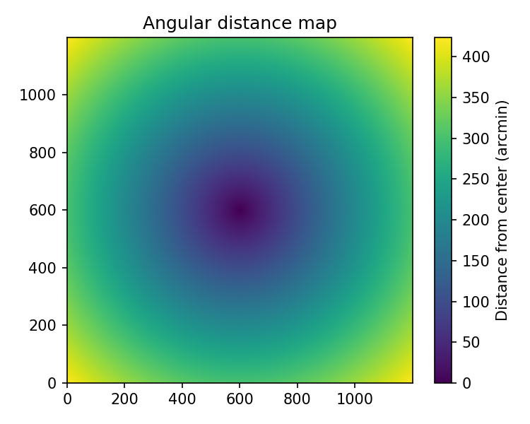
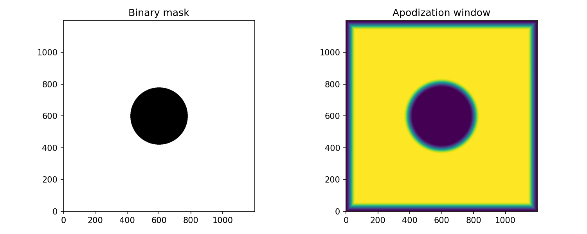
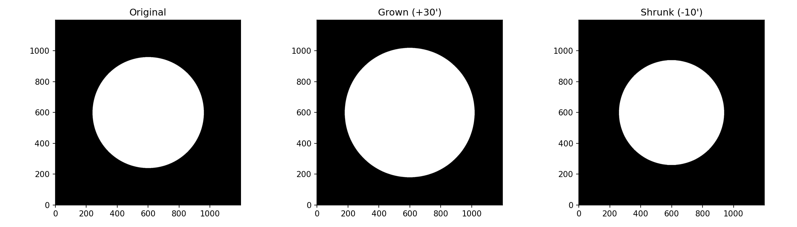

Masking
=======

Masking is a fundamental part of CMB map analysis: regions contaminated by bright
foregrounds, point sources, or instrumental artifacts must be excluded. Pixell
provides tools for creating binary masks, measuring distances on the sky, and
apodizing (smoothly tapering) mask edges to avoid Fourier-space ringing.

Binary masks
------------

A mask is simply an ``ndmap`` of boolean or float values, where ``True`` (or 1)
marks *valid* pixels and ``False`` (or 0) marks pixels to be excluded. You can
create one from any condition on a map:

.. code-block:: python

    from pixell import enmap, utils
    import numpy as np

    m = enmap.read_map("my_map.fits")

    # Mask pixels where |T| > 500 uK (e.g. bright point sources)
    mask = np.abs(m) < 500.0   # ndmap of bool
    print(mask.dtype)  # bool

    # Apply the mask (zero out bad pixels)
    m_masked = m * mask

    # Alternatively, set bad pixels to NaN
    m_nan = m.copy()
    m_nan[~mask] = np.nan

For a disk-shaped mask around a catalog of sources:

.. code-block:: python

    from pixell import enmap, utils
    import numpy as np

    m = enmap.read_map("my_map.fits")

    # Source positions: [[dec1, dec2, ...], [ra1, ra2, ...]] in radians
    src_poss = np.array([[0.0, 0.05], [0.0, 0.03]])

    # Mask within 5 arcmin of each source
    r_mask = 5 * utils.arcmin
    dist_map = enmap.distance_from(m.shape, m.wcs, src_poss, rmax=2 * r_mask)
    mask = dist_map > r_mask   # True = good pixel (outside exclusion zone)

    m_masked = m * mask

Distance transforms
--------------------

:py:func:`pixell.enmap.distance_from` computes the angular distance from each pixel
to the nearest of a set of positions:

.. code-block:: python

    from pixell import enmap, utils
    import numpy as np

    shape, wcs = enmap.geometry2(
        pos=np.array([[-5, -5], [5, 5]]) * utils.degree,
        res=0.5 * utils.arcmin,
    )

    # Single reference point at the center
    center = np.array([[0.0], [0.0]])
    dist_map = enmap.distance_from(shape, wcs, center)   # radians per pixel

    # Convert to arcmin
    dist_arcmin = np.rad2deg(dist_map) * 60.0

   Angular distance of each pixel from the map centre, in arcminutes.

:py:func:`pixell.enmap.distance_transform` computes, for each pixel, the distance
to the nearest *nonzero* pixel in a binary map — useful for growing or shrinking
masks:

.. code-block:: python

    from pixell import enmap, utils
    import numpy as np

    shape, wcs = enmap.geometry2(
        pos=np.array([[-5, -5], [5, 5]]) * utils.degree,
        res=0.5 * utils.arcmin,
    )

    # Binary mask: 1 inside a disk, 0 outside
    dist_center = enmap.distance_from(shape, wcs, np.array([[0.0], [0.0]]))
    mask = (dist_center < 2.0 * utils.degree).astype(float)

    # Distance to the mask boundary for each unmasked pixel
    dist_to_edge = enmap.distance_transform(mask)

Apodization
-----------

Apodization smoothly tapers the map to zero at its edges (or at mask boundaries)
to avoid sharp discontinuities that cause ringing in Fourier transforms. Always
apodize before computing power spectra on real data.

Edge apodization
^^^^^^^^^^^^^^^^^

:py:func:`pixell.enmap.apod` tapers the rectangular boundary of a map:

.. code-block:: python

    from pixell import enmap, utils
    import numpy as np

    m = enmap.read_map("my_patch.fits")

    # Taper the outer 5 arcmin with a cosine profile
    m_apod = enmap.apod(m, width=5 * utils.arcmin, profile="cos")

    # Linear taper instead
    m_apod_lin = enmap.apod(m, width=5 * utils.arcmin, profile="lin")

    # Subtract mean before tapering (useful for maps with a non-zero mean)
    m_apod_mean = enmap.apod(m, width=5 * utils.arcmin, fill="mean")

Mask apodization
^^^^^^^^^^^^^^^^^

:py:func:`pixell.enmap.apod_mask` turns a binary mask into a smooth apodization
window, tapering from 0 (bad) to 1 (good) over a specified width:

.. code-block:: python

    from pixell import enmap, utils
    import numpy as np

    shape, wcs = enmap.geometry2(
        pos=np.array([[-5, -5], [5, 5]]) * utils.degree,
        res=0.5 * utils.arcmin,
    )

    # Source mask: 1 = good, 0 = masked
    center = np.array([[0.0], [0.0]])
    dist   = enmap.distance_from(shape, wcs, center)
    mask   = (dist > 1.5 * utils.degree).astype(float)

    # Apodize the mask edges over 0.5 degrees
    win = enmap.apod_mask(mask.astype(bool), width=0.5 * utils.degree)

   Left: binary source mask (white = good pixels). Right: smooth apodization
   window tapering the mask edges over 0.5°.

Combined apodization workflow
^^^^^^^^^^^^^^^^^^^^^^^^^^^^^^

A typical workflow for a real-data power spectrum:

.. code-block:: python

    from pixell import enmap, utils
    import numpy as np

    m    = enmap.read_map("my_patch.fits")
    ivar = enmap.read_map("my_ivar.fits")   # inverse variance (weight) map

    # 1. Build a binary mask: well-observed regions
    mask = (ivar > 0.1 * np.max(ivar))

    # 2. Apodize the mask
    win = enmap.apod_mask(mask, width=1.0 * utils.degree)

    # 3. Also apodize the rectangular boundary
    win = enmap.apod(win, width=2 * utils.arcmin)

    # 4. Apply window to map before FFT
    m_windowed = m * win

    # 5. Correct power spectrum for the window (w2 normalization)
    w2 = np.mean(win**2)

    fmap = enmap.fft(m_windowed, normalize="phys")
    p2d  = np.abs(fmap)**2 / w2
    ls, cl = enmap.lbin(p2d, bsize=100)

Growing and shrinking masks
----------------------------

:py:func:`pixell.enmap.grow_mask` and :py:func:`pixell.enmap.shrink_mask` expand
or contract a binary mask by a fixed angular radius:

.. code-block:: python

    from pixell import enmap, utils
    import numpy as np

    shape, wcs = enmap.geometry2(
        pos=np.array([[-5, -5], [5, 5]]) * utils.degree,
        res=0.5 * utils.arcmin,
    )

    # Start with a binary mask
    center = np.array([[0.0], [0.0]])
    dist   = enmap.distance_from(shape, wcs, center)
    mask   = (dist < 3.0 * utils.degree)  # disk

    # Grow the mask (expand the masked region) by 30 arcmin
    mask_grown  = enmap.grow_mask(mask, 30 * utils.arcmin)

    # Shrink the mask (contract the good region) by 10 arcmin
    mask_shrunk = enmap.shrink_mask(mask, 10 * utils.arcmin)

   From left to right: original disk mask, mask grown by 30\', and mask
   shrunk by 10\'.
