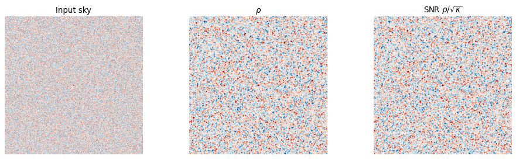
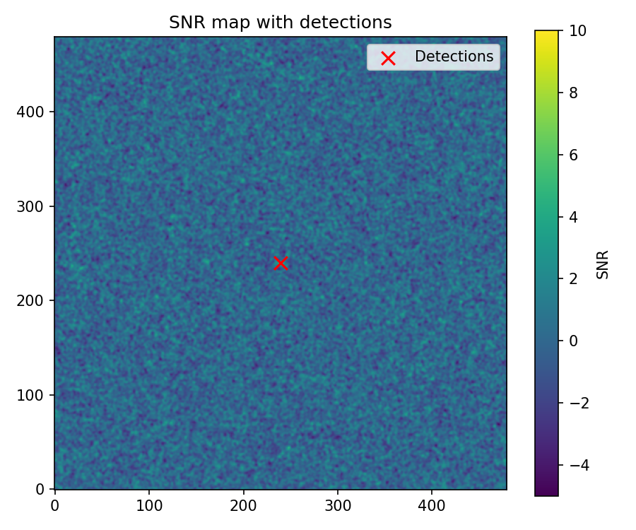

Matched filtering
=================

Matched filtering is the optimal linear method for detecting a known signal
profile in the presence of noise. It is widely used in CMB science for detecting
point sources, galaxy clusters (via the Sunyaev–Zel'dovich effect), and other
compact objects. Pixell implements matched filtering in the
:py:mod:`pixell.analysis` module, built on top of the unified harmonic transform
:py:class:`pixell.uharm.UHT`.

The output of a matched filter is two maps:

* **rho**: the "response" map — proportional to the amplitude of the matched
  signal at each position.
* **kappa**: the "normalization" map — the expected response to a unit-amplitude
  signal (essentially the inverse variance of the flux estimate).

The flux and its uncertainty at any position ``pos`` are then:

.. math::

   \hat{A} = \rho(\theta) / \kappa(\theta), \qquad
   \sigma_A = \kappa(\theta)^{-1/2}

and the signal-to-noise ratio (SNR) is :math:`\rho / \sqrt{\kappa}`.

The UHT (Unified Harmonic Transform)
--------------------------------------

The :py:class:`pixell.uharm.UHT` class provides a unified interface to both
flat-sky (FFT) and curved-sky (SHT) harmonic transforms. Most :py:mod:`analysis`
functions accept a ``uht`` argument that controls which regime is used:

.. code-block:: python

    from pixell import enmap, utils, uharm
    import numpy as np

    shape, wcs = enmap.geometry2(
        pos=np.array([[-2, 2], [2, -2]]) * utils.degree,
        res=0.5 * utils.arcmin,
    )

    # Auto mode: uses flat-sky for small patches, curved-sky for large ones
    uht = uharm.UHT(shape, wcs)

    # Force flat-sky (FFT)
    uht_flat = uharm.UHT(shape, wcs, mode="flat")

    # Force curved-sky (SHT), specify lmax
    uht_curved = uharm.UHT(shape, wcs, mode="curved", lmax=6000)

    # Access the multipole map (flat: 2D enmap; curved: 1D array)
    print(uht.l.shape)   # (ny, nx) in flat mode

White-noise matched filter
---------------------------

:py:func:`pixell.analysis.matched_filter_white` is the simplest matched filter.
It assumes that the noise is *spatially uncorrelated* (white), with an amplitude
that may vary across the sky (given by an inverse-variance map ``ivar``):

.. code-block:: python

    from pixell import enmap, utils, uharm, analysis
    import numpy as np

    # --- Setup ---
    pos        = [0, 0]   # source position (dec, ra) in radians
    shape, wcs = enmap.geometry2(
        pos=np.array([[-2, 2], [2, -2]]) * utils.degree,
        res=0.5 * utils.arcmin,
    )
    uht     = uharm.UHT(shape, wcs)
    pixarea = enmap.pixsizemap(shape, wcs)

    # Gaussian beam with 1.4 arcmin FWHM
    bsigma = 1.4 * utils.fwhm * utils.arcmin
    beam   = np.exp(-0.5 * uht.l**2 * bsigma**2)  # B(ell)

    # A 100 uK point source convolved with the beam
    signal = 100 * np.exp(-0.5 * enmap.modrmap(shape, wcs, pos)**2 / bsigma**2)

    # Uniform white noise at 10 uK-arcmin
    ivar  = 10**-2 * pixarea / utils.arcmin**2
    noise = enmap.rand_gauss(shape, wcs) / ivar**0.5
    sky   = signal + noise

    # --- Apply matched filter ---
    rho, kappa = analysis.matched_filter_white(sky, beam, ivar, uht)

    # Flux estimate and uncertainty at the source position
    flux  = rho.at(pos) / kappa.at(pos)
    dflux = kappa.at(pos)**-0.5
    snr   = flux / dflux
    print(f"flux = {flux:.1f} ± {dflux:.1f} uK  (SNR = {snr:.1f})")

.. code-block:: python

    import matplotlib.pyplot as plt
    import numpy as np

    snr_map = rho / kappa**0.5
    fig, axes = plt.subplots(1, 3, figsize=(12, 3.5))
    for ax, mp, title in zip(axes, [sky, rho, snr_map],
                              ["Input sky", r"$\rho$",
                               r"SNR $\rho/\sqrt{\kappa}$"]):
        vmax = 3 * np.std(mp)
        ax.imshow(mp, origin="lower", cmap="RdBu_r", vmin=-vmax, vmax=vmax)
        ax.set_title(title)
        ax.axis("off")
    plt.tight_layout()
    plt.savefig("matched_filter_white.png", dpi=80, bbox_inches="tight")

   Left: input sky map (point source + white noise). Centre: matched-filter
   response :math:`\rho`. Right: SNR map :math:`\rho/\sqrt{\kappa}`.

Constant-covariance matched filter
------------------------------------

:py:func:`pixell.analysis.matched_filter_constcov` handles the case where the
noise is described by a 1D power spectrum ``iN(ell)`` (constant covariance in
harmonic space). This is appropriate when the noise is stationary and isotropic:

.. code-block:: python

    from pixell import enmap, utils, uharm, analysis
    import numpy as np

    shape, wcs = enmap.geometry2(
        pos=np.array([[-2, 2], [2, -2]]) * utils.degree,
        res=0.5 * utils.arcmin,
    )
    uht     = uharm.UHT(shape, wcs)
    bsigma  = 1.4 * utils.fwhm * utils.arcmin
    beam    = np.exp(-0.5 * uht.l**2 * bsigma**2)

    signal  = 100 * np.exp(-0.5 * enmap.modrmap(shape, wcs)**2 / bsigma**2)

    # 1/f noise: flat at 10 uK-arcmin with knee at ell=2000
    iN = 10**-2 / utils.arcmin**2 / (1 + ((uht.l + 0.5) / 2000)**-3)

    noise  = enmap.rand_gauss(shape, wcs)  # placeholder; normally from sims
    sky    = signal + noise

    rho, kappa = analysis.matched_filter_constcov(sky, beam, iN, uht)

    # kappa is a scalar (constant over the map) in constcov mode
    pos   = [0, 0]
    flux  = rho.at(pos) / kappa
    dflux = kappa**-0.5
    print(f"flux = {flux:.1f} ± {dflux:.1f} uK")

Correlated noise with spatially varying depth
----------------------------------------------

The most general case combines a spatially varying noise level (``ivar``) with a
correlated noise power spectrum (``iN``). Use
:py:func:`pixell.analysis.matched_filter_constcorr_lowcorr` for the most
accurate result, or
:py:func:`pixell.analysis.matched_filter_constcorr_smoothivar` for a faster
approximation:

.. code-block:: python

    from pixell import enmap, utils, uharm, analysis
    import numpy as np

    shape, wcs = enmap.geometry2(
        pos=np.array([[-2, 2], [2, -2]]) * utils.degree,
        res=0.5 * utils.arcmin,
    )
    uht     = uharm.UHT(shape, wcs)
    pixarea = enmap.pixsizemap(shape, wcs)
    bsigma  = 1.4 * utils.fwhm * utils.arcmin
    beam    = np.exp(-0.5 * uht.l**2 * bsigma**2)
    signal  = 100 * np.exp(-0.5 * enmap.modrmap(shape, wcs)**2 / bsigma**2)

    # Spatially varying depth (e.g., deeper at center due to scan strategy)
    ivar = 10**-2 * pixarea / utils.arcmin**2
    ivar *= (1 + 0.9 * np.sin(enmap.posmap(shape, wcs)[1] / (5 * utils.arcmin)))

    # Correlated noise spectrum (dimensionless -- units are in ivar)
    iN = 1.0 / (1 + ((uht.l + 0.5) / 2000)**-3)

    noise  = enmap.rand_gauss(shape, wcs)  # placeholder
    sky    = signal + noise

    # Most accurate: "low-correlation" approximation
    rho, kappa = analysis.matched_filter_constcorr_lowcorr(sky, beam, ivar, iN, uht)

    # Faster alternative: smooth-ivar approximation
    rho2, kappa2 = analysis.matched_filter_constcorr_smoothivar(sky, beam, ivar, iN, uht)

    pos  = [0, 0]
    flux = rho.at(pos) / kappa.at(pos)
    print(f"flux = {flux:.1f} uK")

Measuring the noise spectrum from simulations
----------------------------------------------

When an analytic noise model is not available, you can estimate ``iN`` from a set
of noise simulations:

.. code-block:: python

    from pixell import enmap, utils, uharm, analysis
    import numpy as np

    shape, wcs = enmap.geometry2(
        pos=np.array([[-2, 2], [2, -2]]) * utils.degree,
        res=0.5 * utils.arcmin,
    )
    uht     = uharm.UHT(shape, wcs)
    pixarea = enmap.pixsizemap(shape, wcs)

    # Spatially varying depth
    ivar = 10**-2 * pixarea / utils.arcmin**2

    # Generate noise simulations
    nsim   = 100
    white  = enmap.rand_gauss((nsim,) + shape, wcs)
    # Apply 1/f coloring and spatial ivar weighting
    iN_true = 1.0 / (1 + ((uht.l + 0.5) / 2000)**-3)
    noise_sims = uht.harm2map(uht.lmul(iN_true**-0.5, uht.map2harm(white))) / ivar**0.5

    # Measure empirical noise spectrum from the whitened noise
    iN_emp = 1.0 / (
        np.mean(np.abs(uht.map2harm(noise_sims * ivar**0.5))**2, axis=0)
        / noise_sims.pixsize()
    )

    # Use empirical spectrum in matched filter
    bsigma = 1.4 * utils.fwhm * utils.arcmin
    beam   = np.exp(-0.5 * uht.l**2 * bsigma**2)
    sky    = enmap.zeros(shape, wcs)   # fill with your data

    rho, kappa = analysis.matched_filter_constcorr_lowcorr(sky, beam, ivar, iN_emp, uht)

Converting units: uK to mJy
-----------------------------

Source catalogs typically report fluxes in mJy. You can include a unit conversion
factor ``fconv`` (in units of mJy/sr per uK) to get the output directly in mJy:

.. code-block:: python

    from pixell import utils

    # Rayleigh-Jeans conversion at 150 GHz
    fconv = utils.dplanck(150e9, utils.T_cmb) / 1e3   # uK → mJy/sr

    # Scale the map and ivar before filtering
    rho, kappa = analysis.matched_filter_white(
        sky * fconv, beam, ivar / fconv**2, uht
    )

    flux  = rho.at(pos) / kappa.at(pos)   # mJy
    dflux = kappa.at(pos)**-0.5           # mJy

SNR maps and source detection
-------------------------------

The SNR map :math:`\rho / \sqrt{\kappa}` can be used for automated source
detection by thresholding:

.. code-block:: python

    import scipy.ndimage
    import numpy as np

    snr_map = rho / kappa**0.5

    # Find local maxima above SNR > 5
    snr_thresh = 5.0
    peaks = (snr_map == scipy.ndimage.maximum_filter(snr_map, size=5))
    peaks &= (snr_map > snr_thresh)

    # Get positions of detections
    peak_pix = np.array(np.where(peaks))   # (2, ndet) -- y, x pixel indices
    peak_pos = snr_map.pix2sky(peak_pix)   # (2, ndet) -- dec, ra in radians
    peak_snr = snr_map[peaks]
    print(f"Found {len(peak_snr)} detections above SNR={snr_thresh}")

   SNR map :math:`\rho/\sqrt{\kappa}` with sources detected above SNR = 5
   marked with red crosses.
