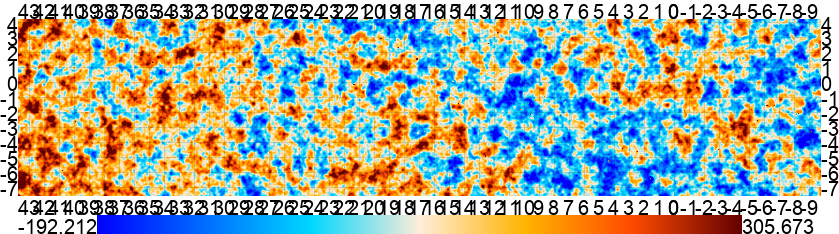

Plotting Maps with pixell
=========================

:py:mod:`pixell.enplot` can be used to plot maps and the results of any analysis 
performed with pixell.

The module is a wrapper around different map plotting mechanisms. It provides the basic 
plotting functionality, such as plot and show, as well as the ability to read and 
write maps.

Plot and show
-------------

The main functionality is provided by the :py:func:`pixell.enplot.plot` function, which
plots a list of maps or map files. Doing

.. code-block:: python

    >>> imap = ... # an Pixell map, or a file name to a map
    >>> plots = enplot.plot(imap)
    >>> print(plots)
    [Bunch(base='', ci=0, cn=1, comp='', dir='', ext='png', fcomp='', fi=0, fn=1, iext='', img=<PIL.Image.Image image mode=RGBA size=6462x1473 at 0x12790BFD0>, info=Bunch(bounds=array([[ -18,  -19],
        [6444, 1454]]), names=['img', 'grid', 'tics']), layer='', name='.png', pi=0, pn=1, pre='', printer=<pixell.enplot.Printer object at 0x1279ad0d0>, suf='', type='pil')]

will produce a list of plots with one element which will correspond to `imap`. From there,
you will want to show this plot on your your notebook. Simply calling 
:py:func:`pixell.enplot.show` will do this for you.

.. code-block:: python
    
    >>> enplot.show(plots)

will display:

.. figure:: plots/example1.png
   :alt: Example plot
   :width: 800px

:py:func:`pixell.enplot.plots` allows you to further customize your plots. A list of 
all possible arguments are shown in :ref:`enplot-interface` below. Please note that you
need to change the dashes `--` to underscores `_` when using the function in Python. For example, 
``--mask-tol`` becomes ``mask_tol``.

For example:

.. code-block:: python

    >>> plots = enplot.plot(imap, colorbar=True, color='planck', grid=True, ticks=1, grid_width=1, font_size=20, downgrade=4)
    >>> enplot.show(plots)

will display:

Furthermote, you can also use the :py:func:`pixell.enplot.pshow` function to create and show
a plot immediately. This function is a wrapper around :py:func:`pixell.enplot.plot` and
:py:func:`pixell.enplot.show`. It takes the same arguments as :py:func:`pixell.enplot.plot`,
but does not return a list of plots. Instead, it shows the plot immediately.
For example:
.. code-block:: python

    enplot.pshow(imap, colorbar=True, color='planck', grid=True, ticks=1, grid_width=1, font_size=20, downgrade=4)

.. _enplot-interface:

Command-line interface
----------------------

In addition to the Python API, :py:mod:`pixell.enplot` can be used as a command-line tool.
The command-line interface is available as ``pixell.enplot``
**Command-line arguments:**

``-o``, ``--oname`` (type:str, default:"{dir}{pre}{base}{suf}{comp}{layer}.{ext}")
    The format to use for the output name.

``-c``, ``--color``, (type: str, default: "planck")
    The color scheme to use, e.g. planck, wmap, gray, hotcold, etc., or a colors pecification in the form val:rrggbb,val:rrggbb.

``-r``, ``--range`` (type: str)  
    The symmetric color bar range to use. If specified, colors in the map will be truncated to [-range,range]. To give each component in a multidimensional map different color ranges, use a colon-separated list, for example ``-r 250:100:50`` would plot the first component with a range of 250, the second with a range of 100 and the third and any subsequent component with a range of 50.

``--min`` (type: str)  
    The value at which the color bar starts. See `--range`.

``--max`` (type: str)  
    The value at which the color bar ends. See `--range`.

``-q``, ``--quantile`` (type: float, default: 0.01)  
    Which quantile to use when automatically determining the color range. If specified, the color bar will go from [quant(q),quant(1-q)].

``-v`` (dest: verbosity, action: count, default: 0)  
    Verbose output. Specify multiple times to increase verbosity further.

``-u``, ``-s``, ``--upgrade``, ``--scale`` (type: str, default: "1")  
    Upscale the image using nearest neighbor interpolation by this amount before plotting. For example, 2 would make the map twice as large in each direction, while 4,1 would make it 4 times as tall and leave the width unchanged.

``--verbosity`` (dest: verbosity, type: int)  
    Specify verbosity directly as an integer.

``--method`` (default: "auto")  
    Which colorization implementation to use: auto, fortran or python.

``--slice`` (type: str)  
    Apply this numpy slice to the map before plotting.

``--sub`` (type: str)  
    Slice a map based on dec1:dec2,ra1:ra2.

``-H``, ``--hdu`` (type: int, default: 0)  
    Header unit of the fits file to use.

``--op`` (type: str)  
    Apply this general operation to the map before plotting. For example, ``log(abs(m))`` would give you a logarithmic plot.

``--op2`` (type: str)  
    Like op, but allows multiple statements.

``-d``, ``--downgrade`` (type: str, default: "1")  
    Downscale the map by this factor before plotting. This is done by averaging nearby pixels. See --upgrade for syntax.

``--prefix`` (type: str, default: "")  
    Specify a prefix for the output file. See `--oname`.

``--suffix`` (type: str, default: "")  
    Specify a suffix for the output file. See `--oname`.

``--odir`` (type: str, default: None)  
    Override the output directory. See `--oname`.

``--ext`` (type: str, default: "png")  
    Specify an extension for the output file. This will determine the file type of the resulting image. Can be anything PIL recognizes. The default is png.

``-m``, ``--mask`` (type: float)  
    Mask this value, making it transparent in the output image. For example ``-m 0`` would mark all values exactly equal to zero as missing.

``--mask-tol`` (type: float, default: 1e-14)  
    The tolerance to use with --mask.

``-g``, ``--grid`` (action: count, default: 1)  
    Toggle the coordinate grid. Disabling it can make plotting much faster when plotting many small maps.

``--grid-color`` (type: str, default: "00000020")  
    The RGBA color to use for the grid.

``--grid-width`` (type: int, default: 1)  
    The line width to use for the grid.

``-t``, ``--ticks`` (type: str, default: "1")  
    The grid spacing in degrees. Either a single number to be used for both axis, or ty,tx.

``--tick-unit``, ``--tu`` (type: str, default: None)  
    Units for tick axis. Can be the unit size in degrees, or the word 'degree', 'arcmin' or 'arcsec' or the shorter 'd','m','s'.

``--nolabels`` (action: store_true)  
    Disable the generation of coordinate labels outside the map when using the grid.

``--nstep`` (type: int, default: 200)  
    The number of steps to use when drawing grid lines. Higher numbers result in smoother curves.

``--subticks`` (type: float, default: 0)  
    Subtick spacing. Only supported by matplotlib driver.

``-b``, ``--colorbar`` (default: 0, action: count)  
    Whether to draw the color bar or not.

``--font`` (type: str, default: "arial.ttf")  
    The font to use for text.

``--font-size`` (type: int, default: 20)  
    Font size to use for text.

``--font-color`` (type: str, default: "000000")  
    Font color to use for text.

``-D``, ``--driver`` (type: str, default: "pil")  
    The driver to use for plotting. Can be pil (the default) or mpl. pil cleanly maps input pixels to output pixels, and has better coordinate system support, but doesn't have as pretty grid lines or axis labels.

``--mpl-dpi`` (type: float, default: 75)  
    The resolution to use for the mpl driver.

``--mpl-pad`` (type: float, default: 1.6)  
    The padding to use for the mpl driver.

``--rgb`` (action: store_true)  
    Enable RGB mode. The input maps must have 3 components, which will be interpreted as red, green and blue channels of a single image instead of 3 separate images as would be the case without this option. The color scheme is overridden in this case.

``--rgb-mode`` (type: str, default: "direct")  
    The rgb mode to use. Can be direct or direct_colorcap. These only differ in whether colors are preserved when too high or low colors are capped. direct_colorcap preserves colors, at the cost of noise from one noisy component leaking into others during capping.

``--reverse-color`` (action: store_true)  
    Reverse the color scale. For example, a black-to-white scale will become a white-to-black scale.

``-a``, ``--autocrop`` (action: store_true)  
    Automatically crop the image by removing expanses of uniform color around the edges. This is done jointly for all components in a map, making them directly comparable, but is done independently for each input file.

``-A``, ``--autocrop-each`` (action: store_true)  
    As --autocrop, but done individually for each component in each map.

``-L``, ``--layers`` (action: store_true)  
    Output the individual layers that make up the final plot (such as the map itself, the coordinate grid, the axis labels, any contours and labels) as individual files instead of compositing them into a final image.

``--no-image`` (action: store_true)  
    Skip the main image plotting. Useful for getting a pure contour plot, for example.

``-C``, ``--contours`` (type: str, default: None)  
    Enable contour lines. For example ``-C 10`` to place a contour at every 10 units in the map, ``-C 5:10`` to place it at every 10 units, but starting at 5, and ``1,2,4,8`` or similar to place contours at manually chosen locations.

``--contour-type`` (type: str, default: "uniform")  
    The type of the contour specification. Only used when the contours specification is a list of numbers rather than a string (so not from the command line interface). 'uniform': the list is [interval] or [base, interval]. 'list': the list is an explicit list of the values the contours should be at.

``--contour-color`` (type: str, default: "000000")  
    The color scheme to use for contour lines. Either a single rrggbb, a val:rrggbb,val:rrggbb,... specification or a color scheme name, such as planck, wmap or gray.

``--contour-width`` (type: int, default: 1)  
    The width of each contour line, in pixels.

``--annotate`` (type: str, default: None)  
    Annotate the map with text, lines or circles. Should be a text file with one entry per line, where an entry can be: c[ircle] lat lon dy dx [rad [width [color]] t[ext]   lat lon dy dx text [size [color]] l[ine]   lat lon dy dx lat lon dy dx [width [color]] dy and dx are pixel-unit offsets from the specified lat/lon. Alternatively, from python one can pass in a list of lists containing the same information, e.g. [["circle", 5.10,222.3,0,0,32,3,"black"]]

``--annotate-maxrad`` (type: int, default: 0)  
    Assume that annotations do not extend further than this from their center, in pixels. This is used to prune which annotations to attempt to draw, as they can be a bit slow. The special value 0 disables this.

``--stamps`` (type: str, default: None)  
    Plot stamps instead of the whole map. Format is srcfile:size:nmax, where the last two are optional. srcfile is a file with [ra dec] in degrees, size is the size in pixels of each stamp, and nmax is the max number of stamps to produce.

``--tile`` (type: str, default: None)  
    Stack components vertically and horizontally. --tile 5,4 stacks into 5 rows and 4 columns. --tile 5 or --tile 5,-1 stacks into 5 rows and however many columns are needed. --tile -1,5 stacks into 5 columns and as many rows are needed. --tile -1 allocates both rows and columns to make the result as square as possible. The result is treated as a single enmap, so the wcs will only be right for one of the tiles.

``--tile-transpose`` (action: store_true)  
    Transpose the ordering of the fields when stacking. Normally row-major stacking is used. This sets column-major order instead.

``--tile-dims`` (type: str, default: None)  

``-S``, ``--symmetric`` (action: store_true)  
    Treat the non-pixel axes as being asymmetric matrix, and only plot a non-redundant triangle of this matrix.

``-z``, ``--zenith`` (action: store_true)  
    Plot the zenith angle instead of the declination.

``-F``, ``--fix-wcs`` (action: store_true)  
    Fix the wcs for maps in cylindrical projections where the reference point was placed too far away from the map center.

``--pos-ra`` (action: store_true)  
    RA goes from 0 to 360 instead of -180 to 180.

Plotting maps
-------------

:py:func:`pixell.enplot.plot` is the main function for plotting maps. It takes a map and a set of options and produces a plot. The options can be used to control the appearance of the plot, such as the color map, the title, and the axis labels.
:py:func:`pixell.enplot.plot_iterator`
:py:func:`pixell.enplot.get_plots`
:py:func:`pixell.enplot.merge_plots`

Show maps
---------
:py:func:`pixell.enplot.show`
:py:func:`pixell.enplot.pshow`

Plots I/O
---------
:py:func:`pixell.enplot.write`
:py:func:`pixell.enplot.get_map`