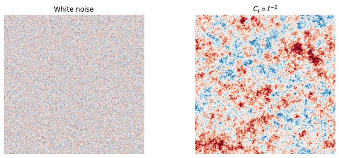
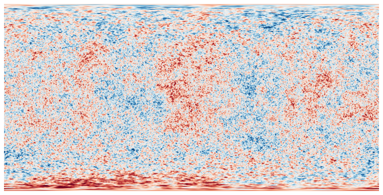
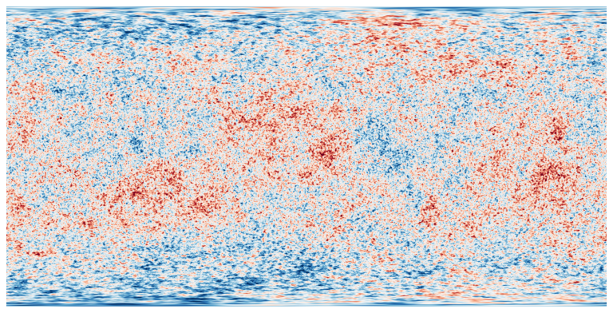
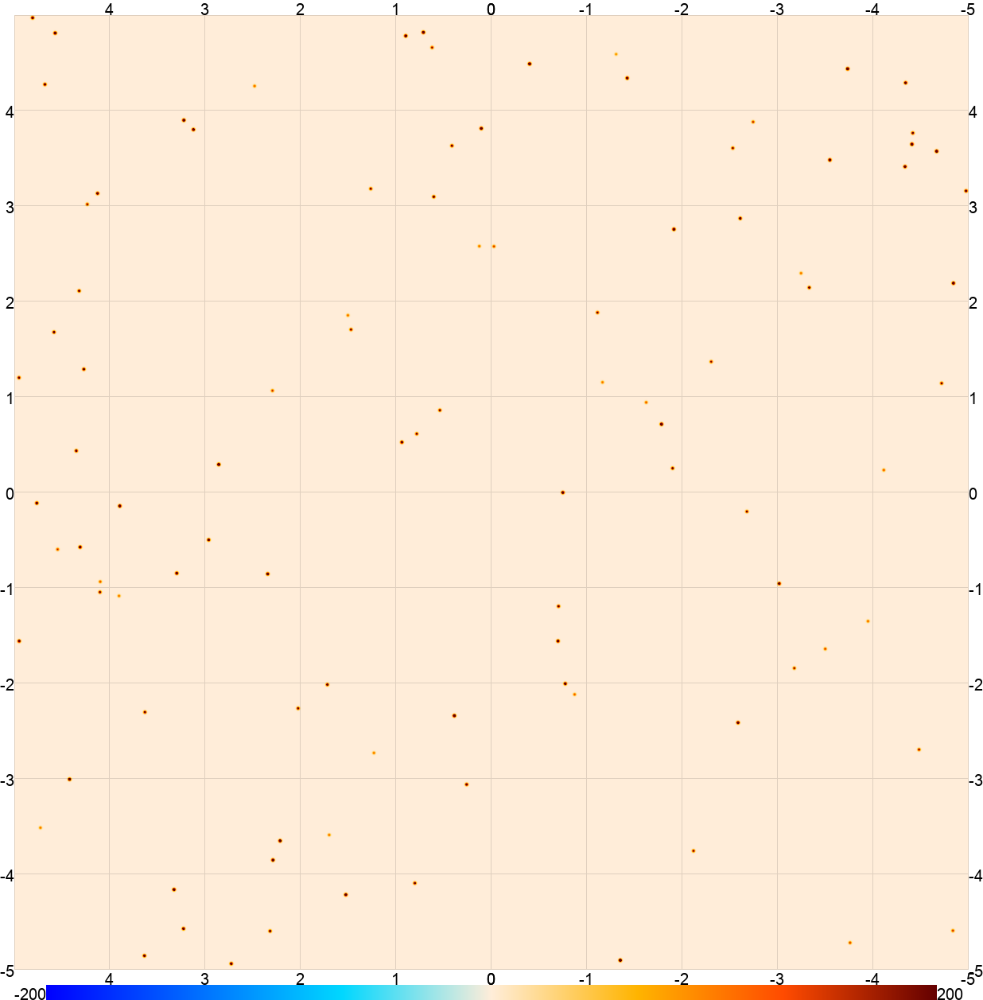
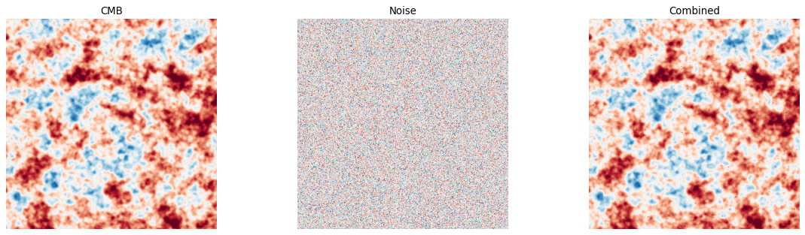

Simulation
==========

Pixell provides tools to simulate realistic sky maps including Gaussian random
fields, gravitational lensing, and compact objects (point sources and clusters).
These are the building blocks for end-to-end simulation pipelines used in CMB
analysis.

Gaussian random fields
-----------------------

Flat-sky simulations
^^^^^^^^^^^^^^^^^^^^^

For small patches, :py:func:`pixell.enmap.rand_map` produces a Gaussian random
field with a given 2D power spectrum directly in pixel space using the FFT:

.. code-block:: python

    from pixell import enmap, powspec, utils
    import numpy as np

    shape, wcs = enmap.geometry2(
        pos=np.array([[-5, -5], [5, 5]]) * utils.degree,
        res=1 * utils.arcmin,
    )

    # White noise
    m_noise = enmap.rand_gauss(shape, wcs)

    # Colored Gaussian field from a 1D power spectrum
    # ps must have shape (lmax+1,) for a scalar map
    lmax = 5000
    ells = np.arange(lmax + 1)
    # Example: Cl ~ ell^{-2} (white-noise-like in log-log)
    cl   = np.zeros(lmax + 1)
    cl[1:] = 1.0 / ells[1:]**2

    # rand_map expects a covariance matrix: shape (ncomp, ncomp, lmax+1)
    cov = cl[None, None, :]
    m_colored = enmap.rand_map(shape, wcs, cov, scalar=True, seed=42)

.. code-block:: python

    import matplotlib.pyplot as plt

    fig, axes = plt.subplots(1, 2, figsize=(10, 4))
    axes[0].imshow(m_noise, origin="lower", cmap="RdBu_r",
                   vmin=-3*m_noise.std(), vmax=3*m_noise.std())
    axes[0].set_title("White noise")
    axes[1].imshow(m_colored, origin="lower", cmap="RdBu_r",
                   vmin=-3*m_colored.std(), vmax=3*m_colored.std())
    axes[1].set_title(r"$C_\ell \propto \ell^{-2}$")
    for ax in axes:
        ax.axis("off")
    plt.tight_layout()
    plt.savefig("rand_flat.png", dpi=80, bbox_inches="tight")

   Left: white-noise realization. Right: colored Gaussian random field with
   :math:`C_\ell \propto \ell^{-2}`, showing visible large-scale structure.

Curved-sky CMB simulations
^^^^^^^^^^^^^^^^^^^^^^^^^^^^

For full-sky or large-area simulations, use :py:func:`pixell.curvedsky.rand_map`
which correctly accounts for sky curvature via spherical harmonic transforms:

.. code-block:: python

    from pixell import enmap, curvedsky, powspec, utils
    import numpy as np

    # Full-sky Fejer1 geometry at 1.5 arcmin resolution
    shape, wcs = enmap.geometry2(res=1.5 * utils.arcmin)

    # Read a CAMB theory spectrum (TT, EE, BB, TE columns)
    # The scale=True flag converts from D_ell to C_ell
    ps = powspec.read_spectrum("camb_theory.dat", scale=True)

    # Simulate a T-only map
    lmax = 6000
    sim_T = curvedsky.rand_map(shape, wcs, ps[0:1, 0:1], lmax=lmax, seed=1)

    # Simulate T, Q, U simultaneously (correlated)
    sim_TQU = curvedsky.rand_map(
        (3,) + shape, wcs, ps, lmax=lmax, spin=[0, 2], seed=2
    )

.. code-block:: python

    import matplotlib.pyplot as plt

    # sim_cmb_T.png — T-only simulation (downgrade 1.5 arcmin → 12 arcmin for display)
    sim_T_disp = sim_T[0].downgrade(8)
    vmax = 3 * sim_T_disp.std()
    plt.figure(figsize=(10, 5))
    plt.imshow(sim_T_disp, origin="lower", cmap="RdBu_r", vmin=-vmax, vmax=vmax)
    plt.axis("off")
    plt.tight_layout()
    plt.savefig("sim_cmb_T.png", dpi=80, bbox_inches="tight")
    plt.close()

    # sim_cmb_T_pol.png — T component of joint T,Q,U simulation
    sim_T_pol_disp = sim_TQU[0].downgrade(8)
    vmax = 3 * sim_T_pol_disp.std()
    plt.figure(figsize=(10, 5))
    plt.imshow(sim_T_pol_disp, origin="lower", cmap="RdBu_r", vmin=-vmax, vmax=vmax)
    plt.axis("off")
    plt.tight_layout()
    plt.savefig("sim_cmb_T_pol.png", dpi=80, bbox_inches="tight")
    plt.close()

   Simulated full-sky CMB temperature map drawn from a CAMB theory spectrum.

   Temperature component of a jointly simulated CMB T, Q, U map.

Reading power spectra
^^^^^^^^^^^^^^^^^^^^^^

:py:func:`pixell.powspec.read_spectrum` reads CAMB-format power spectrum files:

.. code-block:: python

    from pixell import powspec

    # CAMB lensed scalar spectrum: columns l, TT, EE, BB, TE
    # scale=True converts from ell*(ell+1)/2pi * C_ell  ->  C_ell
    ps = powspec.read_spectrum("camb_lensedCls.dat", scale=True)
    print(ps.shape)  # (4, 4, lmax+1) -- TT, TE, EE, BB block matrix

    # Unlensed spectra
    ps_ul = powspec.read_spectrum("camb_scalCls.dat", scale=True)

Gravitational lensing
----------------------

Pixell can apply realistic gravitational lensing to CMB maps. The
:py:mod:`pixell.lensing` module supports both flat-sky and curved-sky lensing.

Flat-sky lensing
^^^^^^^^^^^^^^^^^

For small patches, use :py:func:`pixell.lensing.lens_map`:

.. code-block:: python

    from pixell import enmap, lensing, utils
    import numpy as np

    shape, wcs = enmap.geometry2(
        pos=np.array([[-5, -5], [5, 5]]) * utils.degree,
        res=1 * utils.arcmin,
    )

    # Simulate unlensed CMB temperature
    cov = np.ones((1, 1, 3001)) * 1e-4
    m_unlensed = enmap.rand_map(shape, wcs, cov, scalar=True, seed=10)

    # Simulate a lensing potential (Gaussian random, just for illustration)
    phi = enmap.rand_gauss(shape, wcs) * 1e-4

    # Compute the gradient of phi (deflection field)
    grad_phi = enmap.grad(phi)   # shape (2, ny, nx): [d_dec, d_ra]

    # Apply lensing
    m_lensed = lensing.lens_map(m_unlensed, grad_phi, order=3)

    # Delensing (approximate inverse)
    m_delensed = lensing.delens_map(m_lensed, grad_phi, nstep=3)

Curved-sky lensing
^^^^^^^^^^^^^^^^^^^

For large patches or full-sky work, use
:py:func:`pixell.lensing.lens_map_curved`, which applies lensing via spherical
harmonic operations and properly accounts for sky curvature:

.. code-block:: python

    from pixell import enmap, curvedsky, lensing, powspec, utils
    import numpy as np

    shape, wcs = enmap.geometry2(res=1.5 * utils.arcmin)

    ps = powspec.read_spectrum("camb_lensedCls.dat", scale=True)
    lmax = 6000

    # Draw unlensed CMB alms
    cmb_alm = curvedsky.rand_alm(ps, lmax=lmax, seed=1)

    # Draw lensing potential alm (kappa or phi spectrum needed)
    # Here we use a simple approximation; in practice use a joint CMB+phi spectrum
    ps_phi = powspec.read_spectrum("camb_scalCls.dat", scale=True)
    phi_alm = curvedsky.rand_alm(ps_phi[0:1, 0:1], lmax=lmax, seed=2)

    # Apply curved-sky lensing
    m_lensed = lensing.lens_map_curved(
        shape, wcs, phi_alm, cmb_alm, lmax=lmax, dtype=np.float32
    )

Converting between lensing potential and convergence
^^^^^^^^^^^^^^^^^^^^^^^^^^^^^^^^^^^^^^^^^^^^^^^^^^^^^

.. code-block:: python

    from pixell import lensing

    # phi → kappa:  kappa = ell*(ell+1)/2 * phi
    kappa_alm = lensing.phi_to_kappa(phi_alm)

    # kappa → phi
    phi_alm_back = lensing.kappa_to_phi(kappa_alm)

Point source and cluster simulation
-------------------------------------

:py:func:`pixell.pointsrcs.sim_objects` simulates radially symmetric objects
(point sources, galaxy clusters, etc.) with arbitrary profiles. It is implemented
in C for speed.

Point sources (delta-function profile convolved with beam)
^^^^^^^^^^^^^^^^^^^^^^^^^^^^^^^^^^^^^^^^^^^^^^^^^^^^^^^^^^^

.. code-block:: python

    from pixell import enmap, pointsrcs, utils
    import numpy as np

    shape, wcs = enmap.geometry2(
        pos=np.array([[-5, -5], [5, 5]]) * utils.degree,
        res=0.5 * utils.arcmin,
    )

    # 100 random point sources
    nsrc = 100
    rng  = np.random.default_rng(0)
    box  = np.array([[-5, -5], [5, 5]]) * utils.degree
    # Positions: shape (2, nsrc) -- [dec, ra] in radians
    poss = rng.uniform(box[0], box[1], size=(nsrc, 2)).T

    # Amplitudes in uK (one per source)
    amps = rng.uniform(100, 500, size=(1, nsrc))   # shape (1, nsrc) for T-only

    # Gaussian beam profile
    fwhm  = 1.4 * utils.arcmin
    sigma = fwhm / (8 * np.log(2))**0.5
    r     = np.linspace(0, 5 * sigma, 500)
    beam  = np.exp(-0.5 * r**2 / sigma**2)
    profile = np.array([r, beam])   # shape (2, nsamp)

    sim = pointsrcs.sim_objects(shape, wcs, poss, amps, profile)

   100 random point sources convolved with a 1.4\' FWHM Gaussian beam.

Extended sources (e.g. galaxy clusters with beta profile)
^^^^^^^^^^^^^^^^^^^^^^^^^^^^^^^^^^^^^^^^^^^^^^^^^^^^^^^^^^

.. code-block:: python

    from pixell import enmap, pointsrcs, utils
    import numpy as np

    shape, wcs = enmap.geometry2(
        pos=np.array([[-5, -5], [5, 5]]) * utils.degree,
        res=0.5 * utils.arcmin,
    )

    # Cluster at the center
    poss = np.array([[0.0], [0.0]])   # (dec, ra) in radians
    amps = np.array([[-300.0]])       # SZ decrement in uK

    # Beta-profile: theta_c = 1 arcmin, beta = 2/3
    theta_c = 1.0 * utils.arcmin
    r = np.linspace(0, 20 * utils.arcmin, 1000)
    beta_profile = (1 + (r / theta_c)**2)**(-1.0)  # simplified
    profile = np.array([r, beta_profile])

    sim_cluster = pointsrcs.sim_objects(shape, wcs, poss, amps, profile)

Combining CMB, noise, and sources
-----------------------------------

A typical simulation pipeline:

.. code-block:: python

    from pixell import enmap, curvedsky, pointsrcs, powspec, utils
    import numpy as np

    shape, wcs = enmap.geometry2(
        pos=np.array([[-5, -5], [5, 5]]) * utils.degree,
        res=1.5 * utils.arcmin,
    )
    lmax = 6000
    rng  = np.random.default_rng(42)

    # 1. CMB
    ps  = powspec.read_spectrum("camb_lensedCls.dat", scale=True)
    cmb = curvedsky.rand_map(shape, wcs, ps[0, 0], lmax=lmax, seed=1)

    # 2. White noise (e.g. 10 uK-arcmin)
    noise_level = 10.0 * utils.arcmin   # uK * rad
    noise = enmap.rand_gauss(shape, wcs) * noise_level / np.sqrt(enmap.pixsize(shape, wcs))

    # 3. Point sources
    nsrc = 200
    box  = enmap.box(shape, wcs)
    poss = rng.uniform(box[0], box[1], size=(nsrc, 2)).T
    amps = rng.uniform(50, 500, size=nsrc)
    fwhm  = 1.4 * utils.arcmin
    sigma = fwhm / (8 * np.log(2))**0.5
    r     = np.linspace(0, 5 * sigma, 500)
    profile = np.array([r, np.exp(-0.5 * r**2 / sigma**2)])
    srcs = pointsrcs.sim_objects(shape, wcs, poss, amps, profile)

    # 4. Combine
    sim_total = cmb + noise + srcs

.. code-block:: python

    import matplotlib.pyplot as plt

    fig, axes = plt.subplots(1, 3, figsize=(15, 4))
    for ax, mp, title in zip(axes, [cmb, noise, sim_total],
                              ["CMB", "Noise", "Combined"]):
        vmax = 3 * np.std(mp)
        ax.imshow(mp, origin="lower", cmap="RdBu_r", vmin=-vmax, vmax=vmax)
        ax.set_title(title)
        ax.axis("off")
    plt.tight_layout()
    plt.savefig("sim_total.png", dpi=80, bbox_inches="tight")

   From left to right: simulated CMB temperature, white noise, and the combined
   map (CMB + noise + point sources).
