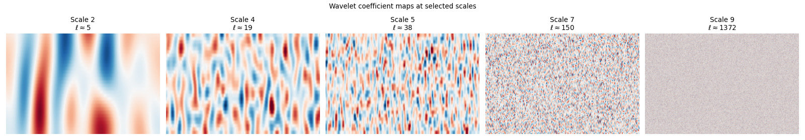
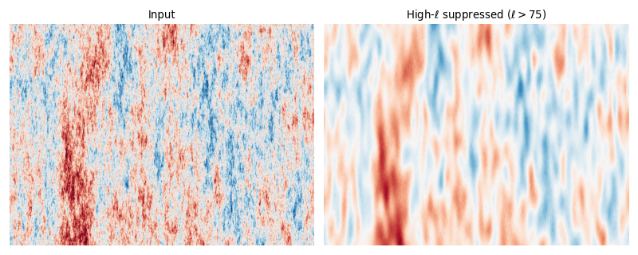
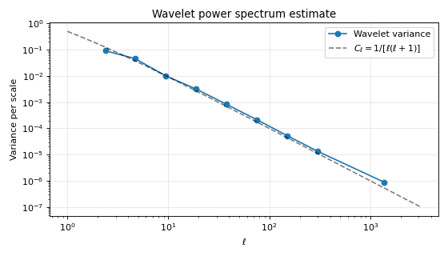

Wavelet analysis
================

Wavelets decompose a map into components that are simultaneously localized in both
real space (angular position) and harmonic space (multipole / angular scale). This
makes them powerful for tasks like multi-scale noise modeling, component separation,
and scale-dependent filtering.

Pixell provides the :py:class:`pixell.wavelets.WaveletTransform` class, which
implements a harmonic-space wavelet decomposition that works on
:py:class:`pixell.enmap.ndmap` objects in both flat-sky (FFT) and curved-sky (SHT)
modes. The transform is built on top of the :py:class:`pixell.uharm.UHT` unified
harmonic transform (see :doc:`harmonic <./harmonic>`).

Wavelet bases
--------------

Several basis types are available. All decompose the multipole range
:math:`[\ell_\text{min}, \ell_\text{max}]` into ``nlevel`` bands:

* **ButterTrim** (default): Butterworth band-pass filters with trimmed tails.
  Good spatial and harmonic localization; recommended for most use cases.
* **Butterworth**: Untrimmed Butterworth filters. Better spatial localization but
  tails extend to arbitrarily high :math:`\ell`.
* **DigitalButterTrim**: Digitized (orthogonal) version of ButterTrim.
* **CosineNeedlet**: Cosine-shaped needlets (Coulton et al. 2023), peaking at
  specified multipoles.
* **AdriSD**: Scale-discrete wavelet basis from the optweight library.

Basic usage
-----------

.. code-block:: python

    from pixell import enmap, uharm, wavelets, curvedsky, utils
    import numpy as np

    # Build a full-sky test map
    shape, wcs = enmap.geometry2(res=3 * utils.arcmin)

    # 1. Create a UHT (Unified Harmonic Transform) for this geometry
    lmax = 2000
    uht = uharm.UHT(shape, wcs, mode="curved", lmax=lmax)

    # 2. Create a wavelet transform with default ButterTrim basis
    wt = wavelets.WaveletTransform(uht)
    print(f"Number of wavelet scales: {wt.nlevel}")
    print(f"Scale mid-points (ell):   {wt.lmids}")

    # 3. Simulate a map and compute forward transform
    ps = np.ones(lmax + 1)
    m  = curvedsky.rand_map(shape, wcs, ps, lmax=lmax, seed=1)
    wmap = wt.map2wave(m)
    print(f"Number of wavelet maps: {len(wmap.maps)}")
    for i, w in enumerate(wmap.maps):
        print(f"  scale {i}: shape={w.shape}, lmid={wt.lmids[i]:.0f}")

    # 4. Inverse transform: wavelet coefficients → map
    m_rec = wt.wave2map(wmap)

The wavelet coefficients are returned as a :py:mod:`pixell.multimap` — a
list-like object of enmaps where each map has the same leading dimensions but
different spatial resolution (lower-:math:`\ell` bands have larger pixels):

.. code-block:: python

    # Access individual wavelet scale maps
    w0 = wmap.maps[0]    # lowest-ell (large-scale) band
    wN = wmap.maps[-1]   # highest-ell (small-scale) band

    # Mathematical operations work on all scales simultaneously
    wmap_scaled = wmap * 2.0           # multiply all coefficients by 2
    wmap_noise  = wmap + wmap * 0.1   # add 10% noise to all scales

.. code-block:: python

    from pixell import enmap, uharm, wavelets, curvedsky, utils
    import numpy as np
    import matplotlib.pyplot as plt

    shape, wcs = enmap.geometry2(res=3 * utils.arcmin)
    uht  = uharm.UHT(shape, wcs, mode="curved", lmax=2000)
    wt   = wavelets.WaveletTransform(uht)

    ells = np.arange(2001)
    ps   = 1.0 / np.where(ells > 0, ells * (ells + 1), 1)
    m    = curvedsky.rand_map(shape, wcs, ps, lmax=2000, seed=42)
    wmap = wt.map2wave(m)

    n = wt.nlevel
    scales_to_show = [2, 4, 5, 7, 9]
    fig, axes = plt.subplots(1, len(scales_to_show),
                             figsize=(4 * len(scales_to_show), 3.5))
    for ax, i in zip(axes, scales_to_show):
        w    = wmap.maps[i]
        ny   = w.shape[-2]
        strip = w[ny // 3 : 2 * ny // 3, :]
        vmax = np.std(w) * 3
        ax.imshow(strip, origin="lower", vmin=-vmax, vmax=vmax,
                  cmap="RdBu_r", aspect="auto")
        ax.set_title(f"Scale {i}\n$\\ell\\approx${wt.lmids[i]:.0f}")
        ax.axis("off")
    plt.suptitle("Wavelet coefficient maps at selected scales")
    plt.tight_layout()
    plt.savefig("wavelet_scales.png", dpi=80)

   Each panel shows the equatorial strip of a wavelet-coefficient map.
   Low-:math:`\ell` scales (left) contain large-scale structure; high-:math:`\ell`
   scales (right) contain fine-scale features.

Choosing a basis
-----------------

.. code-block:: python

    from pixell import enmap, uharm, wavelets, utils

    shape, wcs = enmap.geometry2(res=3 * utils.arcmin)
    lmax = 2000
    uht  = uharm.UHT(shape, wcs, mode="curved", lmax=lmax)

    # ButterTrim with a step ratio of sqrt(2) (finer scale sampling)
    wt_fine = wavelets.WaveletTransform(uht, basis=wavelets.ButterTrim(step=2**0.5))

    # CosineNeedlet peaking at ell = 300, 600, 1200
    lpeaks = [300, 600, 1200]
    wt_needlet = wavelets.WaveletTransform(
        uht, basis=wavelets.CosineNeedlet(lpeaks=lpeaks)
    )

    # Restrict to a specific ell range
    wt_restricted = wavelets.WaveletTransform(
        uht, basis=wavelets.ButterTrim(lmin=200, lmax=1500)
    )

Scale-dependent operations
---------------------------

The key advantage of wavelets is the ability to apply *different* operations to
different angular scales. A common use case is scale-dependent noise weighting:

.. code-block:: python

    from pixell import enmap, uharm, wavelets, multimap, curvedsky, utils
    import numpy as np

    shape, wcs = enmap.geometry2(res=3 * utils.arcmin)
    lmax = 2000
    uht  = uharm.UHT(shape, wcs, mode="curved", lmax=lmax)
    wt   = wavelets.WaveletTransform(uht)

    ps   = np.ones(lmax + 1)
    m    = curvedsky.rand_map(shape, wcs, ps, lmax=lmax, seed=1)
    wmap = wt.map2wave(m)

    # Measure the variance (noise level) in each wavelet scale
    var_per_scale = multimap.var(wmap)   # shape (nlevel,)

    # Inverse-variance weight each scale
    for i, w in enumerate(wmap.maps):
        if var_per_scale[i] > 0:
            w /= var_per_scale[i]

    # Reconstruct
    m_whitened = wt.wave2map(wmap)

Scale-dependent filtering
^^^^^^^^^^^^^^^^^^^^^^^^^^

.. code-block:: python

    from pixell import enmap, uharm, wavelets, curvedsky, utils
    import numpy as np

    shape, wcs = enmap.geometry2(res=3 * utils.arcmin)
    lmax = 2000
    uht  = uharm.UHT(shape, wcs, mode="curved", lmax=lmax)
    wt   = wavelets.WaveletTransform(uht)

    # Scale-invariant input map
    ells = np.arange(lmax + 1)
    ps   = 1.0 / np.where(ells > 0, ells * (ells + 1), 1)
    m    = curvedsky.rand_map(shape, wcs, ps, lmax=lmax, seed=42)
    wmap = wt.map2wave(m)

    # Suppress small-scale power (high-ell bands)
    for i, w in enumerate(wmap.maps):
        if wt.lmids[i] > 75:
            w *= 0.1   # strongly suppress

    m_filtered = wt.wave2map(wmap)

.. code-block:: python

    import matplotlib.pyplot as plt

    ny   = shape[-2]
    vmax = np.std(m[ny // 3 : 2 * ny // 3]) * 3
    fig, axes = plt.subplots(1, 2, figsize=(10, 4))
    axes[0].imshow(m[ny // 3 : 2 * ny // 3],
                   origin="lower", vmin=-vmax, vmax=vmax,
                   cmap="RdBu_r", aspect="auto")
    axes[0].set_title("Input")
    axes[0].axis("off")
    axes[1].imshow(m_filtered[ny // 3 : 2 * ny // 3],
                   origin="lower", vmin=-vmax, vmax=vmax,
                   cmap="RdBu_r", aspect="auto")
    axes[1].set_title(r"High-$\ell$ suppressed ($\ell > 75$)")
    axes[1].axis("off")
    plt.tight_layout()
    plt.savefig("wavelet_filter.png", dpi=80)

   Left: the original scale-invariant map (all angular scales present).
   Right: after suppressing wavelet bands above :math:`\ell \approx 75`,
   only large-scale structure remains.

Wavelet power spectrum
-----------------------

The variance of each wavelet map is directly related to the angular power spectrum
at that scale. This gives a fast, robust power spectrum estimator:

.. code-block:: python

    from pixell import enmap, uharm, wavelets, multimap, curvedsky, utils
    import numpy as np

    shape, wcs = enmap.geometry2(res=3 * utils.arcmin)
    lmax = 2000
    uht  = uharm.UHT(shape, wcs, mode="curved", lmax=lmax)
    wt   = wavelets.WaveletTransform(uht)

    ells = np.arange(lmax + 1)
    ps   = 1.0 / np.where(ells > 0, ells * (ells + 1), 1)
    m    = curvedsky.rand_map(shape, wcs, ps, lmax=lmax, seed=42)
    wmap = wt.map2wave(m)

    # Variance per wavelet scale ~ C_ell at lmid
    var_scales = multimap.var(wmap)   # shape (nlevel,)
    ell_mids   = wt.lmids             # shape (nlevel,)

.. code-block:: python

    import matplotlib.pyplot as plt

    theory_l  = np.logspace(0, 3.5, 200)
    theory_cl = 1.0 / (theory_l * (theory_l + 1))

    plt.figure(figsize=(7, 4))
    plt.loglog(ell_mids[1:], var_scales[1:], 'o-', label="Wavelet variance")
    plt.loglog(theory_l, theory_cl, 'k--', alpha=0.5,
               label=r"$C_\ell = 1/[\ell(\ell+1)]$")
    plt.xlabel(r"$\ell$")
    plt.ylabel(r"Variance per scale")
    plt.title("Wavelet power spectrum estimate")
    plt.grid(True, alpha=0.3)
    plt.legend()
    plt.tight_layout()
    plt.savefig("wavelet_power.png", dpi=80)

   The variance of each wavelet coefficient map tracks the angular power spectrum
   at that scale, providing a fast multi-scale power spectrum estimate.

Curved-sky wavelet transforms
-------------------------------

:py:class:`pixell.wavelets.WaveletTransform` works identically for full-sky or
large-patch maps when the UHT is in curved-sky mode:

.. code-block:: python

    from pixell import enmap, uharm, wavelets, curvedsky, utils
    import numpy as np

    # Full-sky geometry
    shape, wcs = enmap.geometry2(res=3 * utils.arcmin)

    # Curved-sky UHT with lmax=2000
    uht = uharm.UHT(shape, wcs, mode="curved", lmax=2000)
    wt  = wavelets.WaveletTransform(uht)

    # Simulate a band-limited map (e.g. CMB temperature)
    ps  = np.ones(2001)
    m   = curvedsky.rand_map(shape, wcs, ps, lmax=2000, seed=1)

    # Wavelet decomposition on the curved sky
    wmap  = wt.map2wave(m)
    m_rec = wt.wave2map(wmap)

Haar wavelet transform
-----------------------

:py:class:`pixell.wavelets.HaarTransform` provides a simpler, orthogonal 2D
Haar-like wavelet transform that does not use harmonic space. It is faster and
has no mode leakage, but does not have the harmonic localization of
:py:class:`WaveletTransform`:

.. code-block:: python

    from pixell import enmap, wavelets, utils
    import numpy as np

    shape, wcs = enmap.geometry2(
        pos=np.array([[-5, -5], [5, 5]]) * utils.degree,
        res=0.5 * utils.arcmin,
    )
    m = enmap.rand_gauss(shape, wcs)

    # nlevel controls the number of dyadic decomposition levels
    ht    = wavelets.HaarTransform(nlevel=5)
    hmap  = ht.map2wave(m)
    m_rec = ht.wave2map(hmap)
